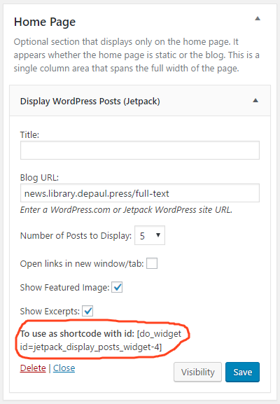
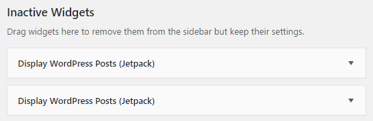
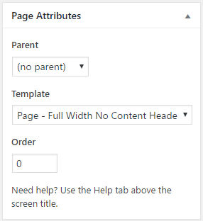
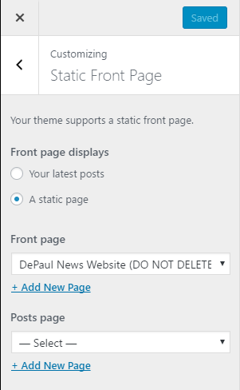

# flatBootstrap-childTheme
This is a child of the flat bootstrap theme https://wordpress.org/themes/flat-bootstrap/

Used for the library news home page: http://news.library.depaul.press/

###### Wordpress Plugins used:
1. amr shortcode any widget
2. Jetpack by WordPress.com

###### Here's how the home page was set up**

**Adding widget:**
- Go to Appearance > Widgets. 
- Two "Display WordPress Posts (Jetpack)" widgets were added to Home Page sidebar section and added the Full Text and Faculty RSS links. 
- After saving, the 'shortcodes' were copied. 
Refer to screenshot: 

- The widgets were moved to the Inactive Widgets section. 
Refer to screenshot: 

 
**Adding the page:**
- Go to Pages > All Pages.
- The page "DePaul News Website (DO NOT DELETE)" was added.
- Using the Text Editor, the HTML code to format the page have been added. Refer to code-for-page-post.html
- The 'shortcodes' copied from the two widgets were added to the code.
- In the Page Attributes settings, "Page - Full Width No Content Header" should be selected. 
Refer to screenshot: 

**Making the page appear on the home page:**
- Go to Appearance > Customize > Static Front Page
- Front page display should be "A static page"
- Front page should be the added page "DePaul News Website (DO NOT DELETE)"
- Leave the Posts page blank or "-Select-"
- Refer to screenshot for reference: 

